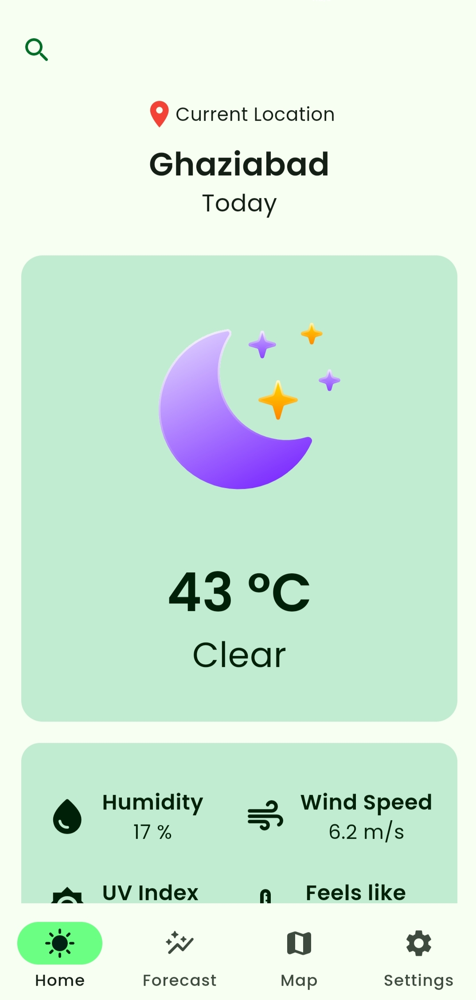
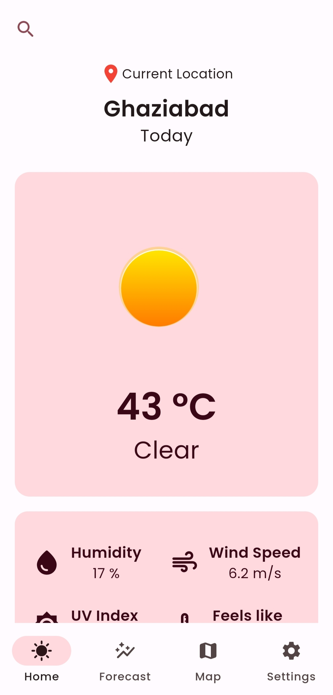
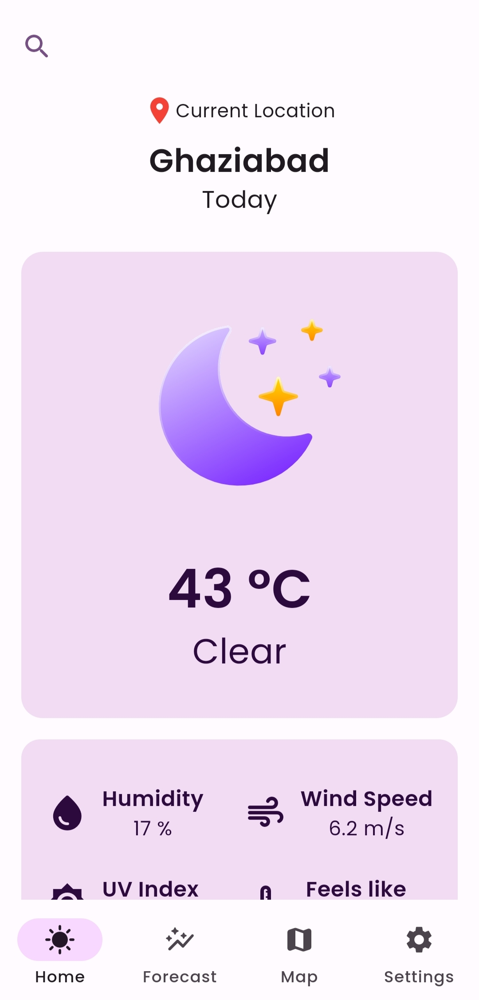
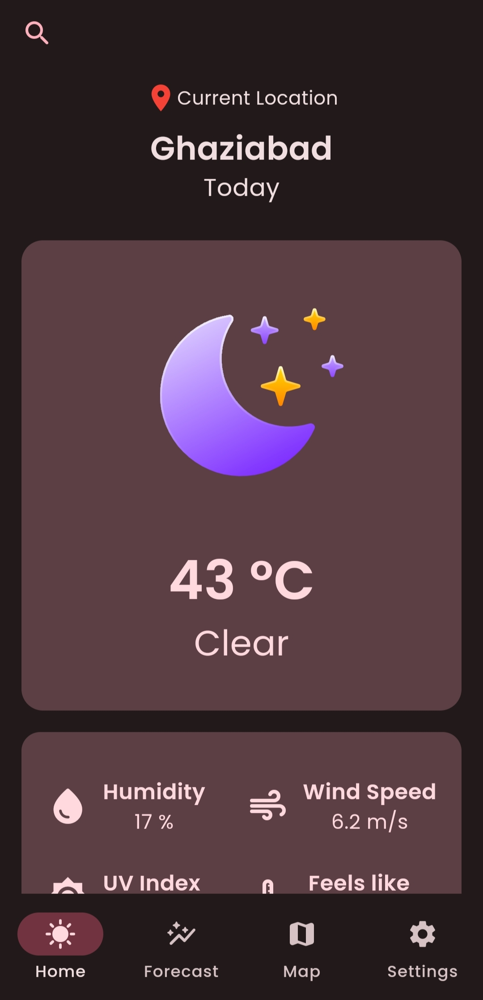
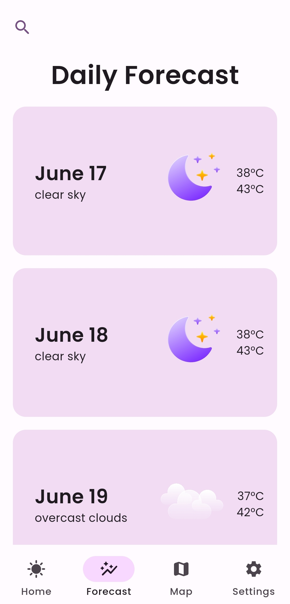
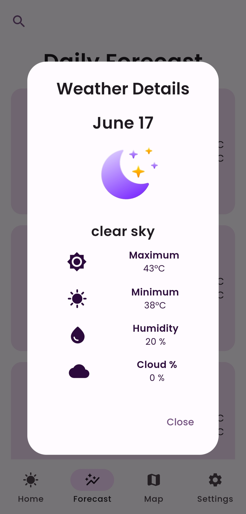
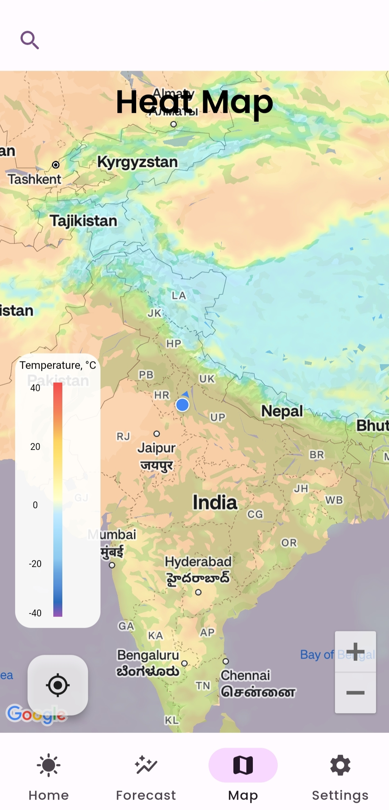
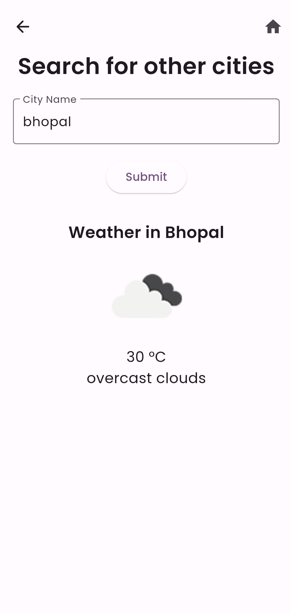
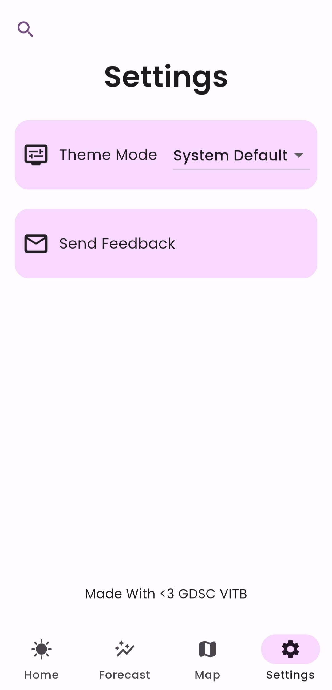

# WEATHERED
### A Comprehensive Weather Forecast App Built with Flutter + Riverpod & Powered by OpenWeather

  
  

## Key Features:
- Beautiful, dynamic Material You design adapts to your theme style of device.
- Relax your eyes with dark theme support.
- Get current weather for your location, instantly.
- Heat Map to visualize the temperature across the globe. 

## Usability :
- Get the current weather of your location.
- Get the quarterly(3 hour interval) weather forecast of your location.
- Get the weather forecast of your location for the next 5 days.
- Get the current weather of any location by searching for it.

## Screenshots :
  
      

## Maintainers :
1. [xkaper001](https://github.com/xkaper001)
2. [TheNoob51](https://github.com/TheNoob51)

## Mentors :
1. [Sparsh-R17](https://github.com/Sparsh-R17)
2. [Akash5336](https://github.com/Akash5336)

## Credits :
- Weather icons taken from [Here](https://www.figma.com/community/file/1126777451931792118/weather-glassmorphism-icon)
- API Services are provided by [OpenWeather](https://openweathermap.org/)

## Steps to run the App :
Excited to experience WEATHERED? Here's how to set it up:

1. **Fork the Repository:** Fork this repository to your account to get a copy for your personal use.
2. **Clone Locally:** Retrieve the project onto your development machine using Git.
3. **Install Flutter:** Ensure you have Flutter and its dependencies installed.
4. **Install Dependencies:** Execute `flutter pub get` to download all required packages.
5. **Obtain an API Key:** Create a free API key from OpenWeather ([https://openweathermap.org/api](https://openweathermap.org/api)).
6. **Configure API Key:** Establish a file named `api_key.dart` within the `lib/src/api` folder, and securely store your OpenWeather API key within this file.
7. **Run the App:** Launch or debug the application using your preferred Flutter environment.
